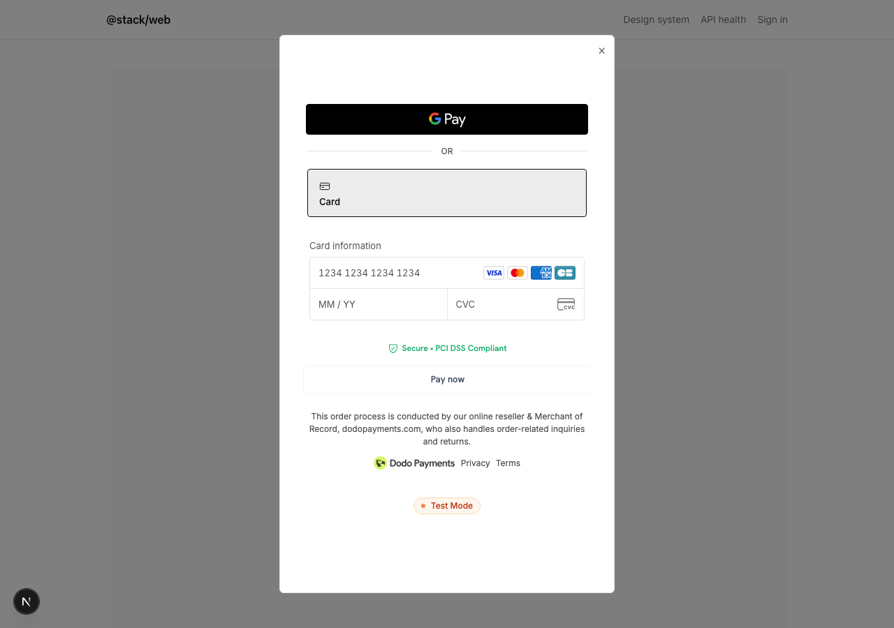

# White-label Dodo Payments checkout modal

An embedded, on-domain checkout that looks like **your** product: your modal chrome, your loading/error states, your success redirect — with Apple Pay / Google Pay rendering in-context. The only vendor trace is the legally-required Merchant-of-Record fine print inside the payment iframe.



## Run it

You need a Dodo Payments **test-mode API key** — nothing else. No pre-created products: the demo route auto-creates a $10 test product on first use (`ensureDemoProduct()`).

```sh
# apps/web/.env.local  (gitignored — never commit)
DODO_ACCESS_TOKEN=<your test-mode key>
DODO_SERVER=test
APP_URL=http://localhost:3000
```

```sh
bun install
cd apps/web && bun x next dev
# open http://localhost:3000/examples/dodo-checkout → Buy now
```

## Files

| File                                        | Role                                                                                             |
| ------------------------------------------- | ------------------------------------------------------------------------------------------------ |
| `page.tsx`                                  | Demo product card + "Buy now" → fetches a checkout URL, opens the modal                          |
| `../../api/examples/dodo-checkout/route.ts` | Server route: creates the session, returns only `{ url }` — the API key never reaches the client |
| `server-create-checkout.ts`                 | `dodopayments` SDK: session creation + demo product bootstrap                                    |
| `dodo-checkout.ts`                          | `dodopayments-checkout` SDK wrapper: inline mount, theming, event dispatch                       |
| `CheckoutModal.tsx`                         | Self-contained modal: skeleton, stay-inline retry, success handling                              |

The three reusable files are published as a standalone gist with the full write-up of the production gotchas (unreliable `form_ready`, the SDK singleton, `checkout.error` double meaning, literal-hex theming, and more): https://gist.github.com/lonormaly/df934d5340b887ff1d6d5d393b25ad54
